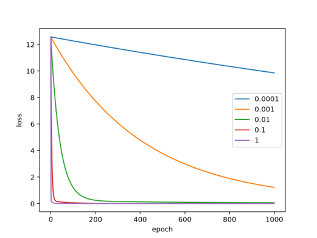

# 经典机器学习算法实验报告


## 实验内容介绍：
本实验围绕经典机器学习，主要通过“推导—从零实现—库实现—实验比较—误差分析”五步法来研究：线性回归与梯度下降、逻辑回归与分类评价、KNN，决策树与集成学习、无监督学习与降维。学习掌握了线性回归、逻辑回归、决策树、KNN、KMean、PCA、层次聚类算法。
实现则先是通过numpy函数从零实现；随后使用sklearn库中的对应算法进行实验，对比两种方法所出的不同结果判断实验数据是否合理，分析其优缺点并预测错误原因

## 实验目的
通过实验，进一步理解监督学习和无监督学习的基本思想，并分析学习率、正则化、类别不平衡、高维数据、标准化和降维等因素对模型效果的影响。
方法：推导—从零实现—库实现—实验比较—误差分析
实验内容：
1. 线性回归与梯度下降；
2. 逻辑回归与分类评价；
3. KNN、决策树与集成学习；
4. K-Means、PCA与层次聚类。
   
## 实验概述
本实验中，每个算法均按照以下五个步骤进行：
1. **推导：** 学习数学原理、所需函数并理解核心公式
2. **从零实现：** 不调用原有python对应的机器学习库函数，使用python和numpy库实现目标推导内容
3. **库实现：** 使用库函数（scikit-learn）中的对应算法进行实现
4. **实验比较：** 使用相同或相近的数据集，对不同实现和不同模型进行比较。
5. **误差分析：** 由于有失败的实验数据，分析模型产生错误的原因并纠正

## 实验代码
本实验的代码都已经上传至：https://github.com/lzy-148/stage-2/tree/main
任务一的代码文件是：https://github.com/lzy-148/stage-2/tree/main/LinearRegression_Project
任务二的代码文件是：https://github.com/lzy-148/stage-2/tree/main/ai-learning
任务三的代码文件是：https://github.com/lzy-148/stage-2/tree/main/KNN
任务四的代码文件是：https://github.com/lzy-148/stage-2/tree/main/Kmeans

执行这组代码的方式是：python run_all.py

## 任务一：线性回归与梯度下降
### 数学原理
对于一元线性回归
$$ \hat{y} = wX + b $$
其中X为矩阵

本实验使用均方误差作为损失函数：
$$\theta=\frac{1}{2m}\sum_{i=1}^{m}(\hat{y}_i-y_i)^2$$

求导可得梯度下降公式
$$\theta=\frac{1}{m}X^T(X\theta-y)$$

对于本实验的学习率$\alpha$采取以下取值：0.0001, 0.001, 0.01, 0.1, 1

### 实现
本实验使用Numpy库自我实现并通过sklearn库再次实现。自我实现过程主要依靠逐次计算梯度下降，每次通过样本计算损失函数的梯度，然后更新，重复以上步骤。
核心代码：
```python
pred=X@theta
error=pred-y
grad=(1/m)* X.T @error
```
实验结果：
### 失败实验
|训练次数 epoch| 梯度下降结果 |解析解|
|---:|---|---|
|1000|[2.42814331, 2.19266259]|[2.02221511, 2.99369350]|
|10000|[2.02318505, 2.99177954]|[2.02221511, 2.99369350]|

结论：当 epochs=1000 时，梯度下降得到的参数与解析解存在较大差异，说明次数较少，模型尚未充分收敛。当 epochs 增加到 10000 后，梯度下降得到的参数已经非常接近解析解，说明增加迭代次数可以使梯度下降逐渐接近最优解。
随后加入了l1、l2的正则化，正则化限制模型参数不要过大，从而减少过拟合。
核心代码：
```python
if reg=="l2":##惩罚偏置项b
grad+=lam*reg_term
if reg=="l1":
grad+=lam*reg_term
```
实验数据：
|lam|模型 l1|b|w|模型 l2|b|w|
|---:|---|---|---|---|---|---|
|0.1|l1|2.22|2.35|l2|2.28|1.94|
|0.01|l1|2.08|2.87|l2|2.17|2.67|
|0.001|l1|2.02|2.97|l2|2.04|2.95|

结论：lam的增大能增加对模型参数的限制，L1和L2均能够降低模型参数幅值。其中L1通过绝对值惩罚产生稀疏效果，L2通过平方惩罚使参数更加平滑。在当前单特征线性回归任务中，由于特征数量较少，L1未明显产生参数稀疏，但仍能降低参数大小。
### 误差分析
实验结果回收学习率、训练次数、正则化等因素影响
如果不同特征的数值大小差别特别大，梯度下降就容易不稳定；而当把它们缩放到差不多的范围，梯度下降则会更快更稳定。正则化的加入能够一定程度上约束这个模型。
1. 为什么归一化会影响梯度下降速度
归一化后，各特征的范围更加接近，可以让梯度下降更加稳定、收敛更快。
2. L1 与 L2 对参数分别产生什么影响
均会让参数变小，l1会起到选择特征的作用，l2则会使模型更加稳定。
3. 训练误差低是否意味着预测能力强
不一定。误差低只能说明在训练数据上表现较好，但可能出现过拟合，在新的测试数据上可能表现很差。


## 任务二：逻辑回归与分类评价
### 数学原理
分类问题需要用到sigmoid函数从而输出概率，其中sigmoid函数为：
$$f(z)=\frac{1}{1+e^{-z}}$$
其中$z=wX+b$
规定输出概率大于0.5时样本为正类，小于0.5为负类

逻辑回归中需要运用二元交叉熵作为损失函数：
$$J=-\frac{1}{m}\sum[ylog_{10}(\hat{y})+(1-y)log_{10}(1-\hat{y})]$$
其中y为真实类别，$\hat{y}$为预测类别
从而使预测距离实际数据越近，损失越小

### 实现
本实验同样使用Numpy库自我实现并通过sklearn库再次实现。自我实现过程主要用sigmoid函数预测概率，迭代梯度，设定阈值从而完成实现。
关键代码：
```python
z=x@self.w+self.b
y_hat=sigmoid(z)
dw=(1/m)*x.T@(y_hat-y.reshape(-1,1))
db=np.mean(y_hat-y.reshape(-1,1))
self.w-=self.l*dw
self.b-=self.l*db
```
对于sklearn库实现，则是运用了sklearn.linear_model中的LogisticRegression库
最终准确率分别为：
|样本|预测概率|预测类别|
|-|-|-|
|1|0.0060|0|
|2|0.7506|1|
|3|0.9998|1|
|4|1.0000|1|

库实现中 1类：944，0类：56

混淆矩阵
| |预测正类|预测负类|
|---|---|---|
|真实正类|TP|FN|
|真实负类|FP|TN|

$$
Precision=\frac{TP}{TP+FP},
Recall=\frac{TP}{TP+FN},
F1=\frac{2PR}{P+R}
$$
ROC-AUC表示区分模型正负的能力，AUC接近1说明分类效果好

### 失败实验
|指标|数值|
|---|---|
|Accuracy|0.915|
|Precision|0.125|
|Recall|0.4|
|F1|0.190|
|AUC|0.725|

|阈值|Precision|Recall|
|---|---|---|
|0.1|0.125|0.4|
|0.3|0.2|0.2|
|0.5|0|0|
|0.7|0|0|

分类阈值对于模型作用有：降低则增加误报，召回率上升；升高可减少误报，模型更加严格，但可能增加漏报。其中0.7为失败实验，实验结论与0.5高度重合，说明升高阈值增加漏报，在数据量少的情况下容易使结果出现极端情况

### 误差分析
逻辑回归在类别平衡数据有较好的分类效果，但对于准确率、召回率、精确率等标准若仅关注单个指标容易产生错误判断。同时分类阈值会影响模型最终分类结果，产生的召回率、准确率等指标也不同，从而说明导致的漏报、误报数量会发生变化


## 任务三：KNN、决策树与集成学习
### 数学原理
距离公式:
$$d=\sqrt{\sum_{i=1}^{n}(x_i-y_i)^2}$$

### KNN算法原理
KNN算法不需要提前学习模型参数，而是在预测计算测试样本与训练样本之间的距离，并选择距离最近的k个样本进行分类。

### 实现
本实验同样使用Numpy库自我实现并通过sklearn库再次实现。实验主要通过计算测试样本与训练数据见的距离->根据距离排序选择最近的k个样本->统计k个样本中出现次数最多的类别作为预测结果。
代码如下：
```python
#KNN/src/knn.py
def distance(self,x,y):
    return np.sqrt((x-y)**2)
neighbors=distances[:self.k]

#KNN/experiment/experiment.py
from sklearn.neighbors import KNeighborsClassifier
model=KNeighborsClassifier(n_neighbors=5)
```

### 决策树
随后实现了分类树：决策树通过不断选择特征进行数据划分，使划分后的类别更加纯净，需配合基尼系数实现。其中基尼系数：
$$gini=1-\sum{p_i}^2$$
而基尼系数越小，节点类别越干净，因此决策树会优先选择基尼系数变化大的划分。
实现如下：先遍历不同特征和划分点，然后计算基尼系数，然后选择基尼系数最小的划分，最后通过递归实现决策树。
代码实现：
```python
##KNN/src/decision_tree/cart.py
    def build_tree(self,X,y,depth=0):
        if depth>=self.max_depth:
            return Node(value=self.majority(y))
        feature,threshold=self.bestsplit(X,y)
        if feature is None:#无法继续划分
            return Node(value=self.majority(y))
        leftindex,rightindex=self.split(X,feature,threshold)
        #创建左右子树
        lefttree=self.build_tree(X[leftindex],y[leftindex],depth+1)
        rightree=self.build_tree(X[rightindex],y[rightindex],depth+1)
        return Node(feature,threshold,lefttree,rightree)
```

### 失败实验
对于高纬度对KNN分类效果影响，在n_information不同的情况下有不同表现，发现在等于0时有异常表现：（组1在更高维准确率应该明显下降）
| 特征维度 | 组1：n_informative=0 | 组2：n_informative=2 |
|---:|---:|---:|
| 2   | 0.9267 | 0.9267 |
| 5   | 0.9467 | 0.8867 |
| 10  | 0.9667 | 0.8167 |
| 20  | 0.9767 | 0.8033 |
| 50  | 0.9200 | 0.7100 |
| 100 | 0.9267 | 0.6367 |

显然组2更符合结论，实验中设置 n_informative=dim，导致新增维度均包含有效分类信息，提高了数据可分性。当维度进一步增加到50和100时，噪声和距离稀疏性影响开始出现，准确率下降，体现出一定的维度灾难现象。

### 误差分析
相同数据上，不同模型为什么会产生不同错误：
不同模型看待数据方式不同，即使使用完全相同的训练集和测试集，不同模型得到的分类边界也不同，最后出错的样本自然也可能不同。
错误是否具有结构性：是，均能够通过模型特点或数据特点解释。


## 任务四：无监督学习与降维
### kmeans数学原理
Kmeans主要用于把数据分成k个簇使同一个簇的样本尽可能相似，分配样本时需用到距离公式：
$$d=\sqrt{\sum_{i=1}^{n}(x_i-y_i)^2}$$
平均同一个簇的样本，随后更新得到新的中心：
$$y_i=\frac{1}{C_i}\sum_{x_i\in C_i}x_i$$

### 实现
本实验同样使用Numpy库自我实现并通过sklearn库再次实现。实现先是计算每个样本与各个聚类中心的距离，然后将样本分配给距离最近的中心，根据每个簇的样本重新计算中心，重复这个过程直至聚类稳定。
```python
###Kmeans/src/kmeans.py
labels=np.array(labels)
new_centers=[]
for j in range(k):
    points=X[labels==j]
    new_center=np.mean(points,axis=0)
    new_centers.append(new_center)
new_centers=np.array(new_centers)
```

### pca数学原理
主要用于保留关键数据，从而减少数据维度，减少模型复杂度。在kmeans以后计算方差矩阵并计算特征向量，通过其中最大的几个特征值得到主成分，最后获得降维后的数据
特征值越大，说明对应的主成分包含的信息越多。
其中需要用到计算方差比：
$$\frac{\lambda_i}{\sum_j\lambda_j}$$

### 实现
主要需要计算方差矩阵与特征值
```python
###Kmeans/src/pca.py
    mean = np.mean(X, axis=0)
    X_center = X - mean
    cov = np.dot(X_center.T, X_center) / (len(X) - 1)
    values, vectors = np.linalg.eigh(cov)
    idx = np.argsort(values)[::-1]
    values = values[idx]
    vectors = vectors[:, idx]
    components = vectors[:, :n_components]
    X_new = np.dot(X_center, components)
```

### 层次聚类
一开始每个样本都是一个簇，然后不断把距离最近的两个簇合并，最终形成一个树状结构，其中需要用到轮廓系数（sklearn库）。
最终得到实验数据：
自己实现轮廓系数：
0.8065476190476191

sklearn：
0.8065476190476191

### 标准化实验
|数据处理|轮廓系数|
|---|---|
|未标准化|0.8620|
|标准化|0.8631|

标准化前后的轮廓系数比较接近，说明本次数据中不同特征的尺度差异并不大，因此标准化对聚类结果的影响较小。

### 误差分析
1. 为什么聚类结果的标签可能不同：因为聚类标签没有固定含义，[0 0 0 1 1 1]与[1 1 1 0 0 0]分组结果实际相同。
2. 为什么标准化会影响聚类：因为 K-Means 和层次聚类都涉及距离计算。计算距离时，某特征的影响可能大于另一个特征，在标准化后特征尺度更为接近。
3. PCA 为什么可以降维：因为原始数据中可能存在很多相关性较强重复的特征，PCA把原先特征合并为更为简洁具有代表性的特征从而达到将为的目的。