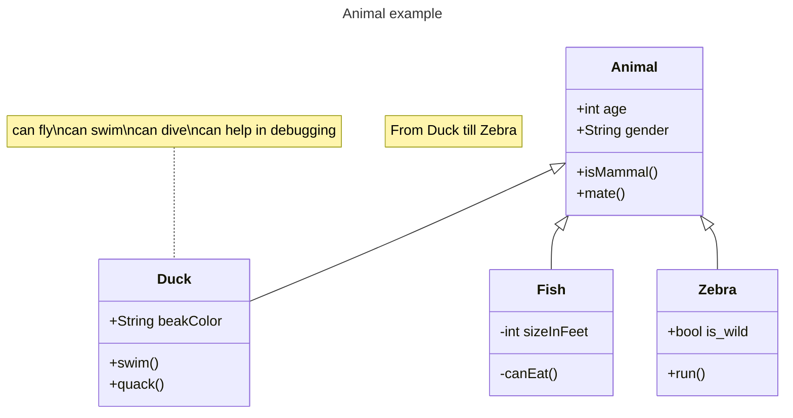

$$
 x = \frac{-b \pm \sqrt{b^2 - 4ac}}{2a} \text{ (二次方程的根)}
$$

$$
\begin{align}
x + y &= 1 \\
x - y &= 0
\end{align}
$$

$$
\begin{matrix}
a & b \\
c & d
\end{matrix}
$$

$$
    \begin{align}
    f(x) &= ax^2 + bx + c \\
    f'(x)  &= 2ax + b \\
    f''(x)  &= 2a
    \end{align}
$$

## 极限 (Limits)

$$
\lim_{x \to 0} \frac{\sin x}{x} = 1
$$

$$
\lim_{n \to \infty} \left(1 + \frac{1}{n}\right)^n = e
$$

## 导数 (Derivatives)

$$
\frac{d}{dx}[x^n] = nx^{n-1}
$$

$$
\frac{d}{dx}[\sin x] = \cos x
$$

$$
\frac{d}{dx}[e^x] = e^x
$$

$$
\frac{d}{dx}[\ln x] = \frac{1}{x}
$$

$$
\frac{d}{dx}[f(g(x))] = f'(g(x)) \cdot g'(x) \quad \text{(链式法则)}
$$

## 积分 (Integrals)

$$
\int x^n \, dx = \frac{x^{n+1}}{n+1} + C \quad (n \neq -1)
$$

$$
\int \frac{1}{x} \, dx = \ln|x| + C
$$

$$
\int e^x \, dx = e^x + C
$$

$$
\int \sin x \, dx = -\cos x + C
$$

$$
\int \cos x \, dx = \sin x + C
$$

## 多重积分 (Multiple Integrals)

**二重积分：**

$$
\iint_R f(x,y) \, dA = \int_{a}^{b} \int_{c}^{d} f(x,y) \, dy \, dx
$$

**三重积分：**

$$
\iiint_V f(x,y,z) \, dV
$$

**极坐标下的二重积分：**

$$
\iint_R f(r,\theta) \, dA = \int_{\alpha}^{\beta} \int_{r_1(\theta)}^{r_2(\theta)} f(r,\theta) \, r \, dr \, d\theta
$$

## 线积分 (Line Integrals)

**第一类线积分（对弧长）：**

$$
\int_C f(x,y) \, ds
$$

**第二类线积分（对坐标）：**

$$
\int_C P \, dx + Q \, dy
$$

**格林公式：**

$$
\oint_C P \, dx + Q \, dy = \iint_D \left( \frac{\partial Q}{\partial x} - \frac{\partial P}{\partial y} \right) \, dA
$$

## 矩阵运算 (Matrix Operations)

**矩阵加法：**

$$
\begin{bmatrix}
a_{11} & a_{12} \\
a_{21} & a_{22}
\end{bmatrix}
+
\begin{bmatrix}
b_{11} & b_{12} \\
b_{21} & b_{22}
\end{bmatrix}
=
\begin{bmatrix}
a_{11}+b_{11} & a_{12}+b_{12} \\
a_{21}+b_{21} & a_{22}+b_{22}
\end{bmatrix}
$$

**矩阵乘法：**

$$
\begin{bmatrix}
a & b \\
c & d
\end{bmatrix}
\begin{bmatrix}
e & f \\
g & h
\end{bmatrix}
=
\begin{bmatrix}
ae+bg & af+bh \\
ce+dg & cf+dh
\end{bmatrix}
$$

**行列式：**

$$
\det(A) = \begin{vmatrix}
a & b \\
c & d
\end{vmatrix}
= ad - bc
$$

**逆矩阵：**

$$
A^{-1} = \frac{1}{\det(A)} \begin{bmatrix}
d & -b \\
-c & a
\end{bmatrix}
$$

**矩阵的转置：**

$$
A^T = \begin{bmatrix}
a_{11} & a_{21} & a_{31} \\
a_{12} & a_{22} & a_{32}
\end{bmatrix}
$$

## 上标和下标 (Superscripts and Subscripts)

**化学分子式：**

$$
H_2O, \quad CO_2, \quad C_6H_{12}O_6
$$

**数学表达式：**

$$
x^2, \quad x^{n+1}, \quad a_{i}, \quad b_{ij}
$$

$$
x_1^2 + x_2^2 + x_3^2 = 1
$$

$$
\sum_{i=1}^{n} a_i
$$

$$
\prod_{i=1}^{n} a_i
$$

$$
\int_{0}^{\infty} f(x) \, dx
$$

$$
\frac{\partial^2 u}{\partial t^2}
$$

**物理学：**

$$
E = mc^2, \quad F = ma, \quad v = v_0 + at
$$

**多阶上下标：**

$$
x_1^2, \quad x_1^2 + y_2^3, \quad \int_{a}^{b} f(x) \, dx
$$

## 希腊字母符号 (Greek Letters)

**小写希腊字母：**

| 符号 | 命令 | 含义 |
|------|------|------|
| $\alpha$ | \alpha | 角度、系数 |
| $\beta$ | \beta | 角度、系数 |
| $\gamma$ | \gamma | 角度、欧拉常数 |
| $\delta$ | \delta | 增量、判别式 |
| $\epsilon$ | \epsilon | 小的正数 |
| $\varepsilon$ | \varepsilon | 小的正数 |
| $\zeta$ | \zeta | 黎曼zeta函数 |
| $\eta$ | \eta | 效率 |
| $\theta$ | \theta | 角度 |
| $\iota$ | \iota | 映射 |
| $\kappa$ | \kappa | 曲率 |
| $\lambda$ | \lambda | 特征值、拉格朗日乘数 |
| $\mu$ | \mu | 摩擦系数、均值 |
| $\nu$ | \nu | 频率 |
| $\xi$ | \xi | 随机变量 |
| $\pi$ | \pi | 圆周率 |
| $\rho$ | \rho | 密度 |
| $\sigma$ | \sigma | 标准差 |
| $\tau$ | \tau | 时间常数 |
| $\upsilon$ | \upsilon | 速度 |
| $\phi$ | \phi | 角度 |
| $\varphi$ | \varphi | 角度 |
| $\chi$ | \chi | 卡方分布 |
| $\psi$ | \psi | 波函数 |
| $\omega$ | \omega | 角速度 |

**大写希腊字母：**

| 符号 | 命令 | 含义 |
|------|------|------|
| $\Alpha$ | \Alpha | - |
| $\Beta$ | \Beta | - |
| $\Gamma$ | \Gamma | 伽马函数、旋转群 |
| $\Delta$ | \Delta | 判别式、拉普拉斯算子 |
| $\Theta$ | \Theta | 大O符号 |
| $\Lambda$ | \Lambda | 拉格朗日函数 |
| $\Xi$ | \Xi | 卡西米尔函数 |
| $\Pi$ | \Pi | 连乘积 |
| $\Sigma$ | \Sigma | 求和 |
| $\Phi$ | \Phi | 势函数 |
| $\Psi$ | \Psi | 波函数 |
| $\Omega$ | \Omega | 欧拉函数、SI单位 |

**常用希腊字母公式示例：**

$$
\lambda x^2 + \mu x + \nu = 0
$$

$$
\sum_{i=1}^{n} \frac{\alpha_i}{\beta_i}
$$

$$
\Gamma(n) = (n-1)!
$$

$$
\Delta = b^2 - 4ac
$$

## 几何符号 (Geometry Symbols)

**角度：**

$$
\angle ABC = 90^\circ
$$

$$
\sin 30^\circ = \frac{1}{2}
$$

**三角形：**

$$
\triangle ABC \cong \triangle DEF
$$

$$
\triangle ABC \sim \triangle DEF
$$

**垂直和平行：**

$$
AB \perp CD, \quad AB \parallel CD
$$

**圆和弧：**

$$
\widehat{AB}, \quad \odot O, \quad \odot(O, r)
$$

**几何公式：**

$$
C = 2\pi r, \quad S = \pi r^2
$$

$$
V = \frac{4}{3}\pi r^3
$$

$$
d = \sqrt{(x_2-x_1)^2 + (y_2-y_1)^2}
$$

**向量：**

$$
\vec{a}, \quad \overrightarrow{AB}, \quad |\vec{v}|
$$

$$
\cos \theta = \frac{\vec{a} \cdot \vec{b}}{|\vec{a}||\vec{b}|}
$$

## 集合符号 (Set Theory Symbols)

**基本集合运算：**

$$
A \cup B, \quad A \cap B, \quad A \setminus B, \quad A^c
$$

$$
A \subseteq B, \quad A \subset B, \quad A \supseteq B, \quad A \supset B
$$

$$
x \in A, \quad x \notin B
$$

**特殊集合：**

$$
\mathbb{N}, \mathbb{Z}, \mathbb{Q}, \mathbb{R}, \mathbb{C}
$$

$$
\emptyset, \quad \{\}, \quad \{a,b,c\}
$$

$$
[0,1], \quad (0,1), \quad [0,1), \quad (0,1]
$$

**集合表达式：**

$$
A = \{x \in \mathbb{R} \mid x > 0\}
$$

$$
B = \{n \in \mathbb{N} \mid n \text{ 是偶数}\}
$$

$$
\{1, 2, 3\} \cup \{2, 3, 4\} = \{1, 2, 3, 4\}
$$

$$
\{1, 2, 3\} \cap \{2, 3, 4\} = \{2, 3\}
$$

**德摩根定律：**

$$
(A \cup B)^c = A^c \cap B^c
$$

$$
(A \cap B)^c = A^c \cup B^c
$$

** cardinality（基数）：**

$$
|A| = n, \quad |\mathbb{N}| = \aleph_0
$$

**直积和映射：**

$$
A \times B, \quad f: A \to B
$$

$$
f^{-1}(A), \quad f(A)
$$

## 综合应用示例

**欧拉公式：**

$$
e^{i\pi} + 1 = 0
$$

$$
e^{i\theta} = \cos\theta + i\sin\theta
$$

**傅里叶变换：**

$$
\hat{f}(\xi) = \int_{-\infty}^{\infty} f(x) e^{-2\pi i x \xi} \, dx
$$

**概率论：**

$$
P(A \mid B) = \frac{P(A \cap B)}{P(B)}
$$

$$
\mathbb{E}[X] = \sum_{i} x_i P(X = x_i)
$$

$$
\sigma^2 = \frac{1}{n}\sum_{i=1}^{n}(x_i - \mu)^2
$$

**统计学：**

$$
\bar{x} = \frac{1}{n}\sum_{i=1}^{n} x_i
$$

$$
\chi^2 = \sum_{i=1}^{n} \frac{(O_i - E_i)^2}{E_i}
$$